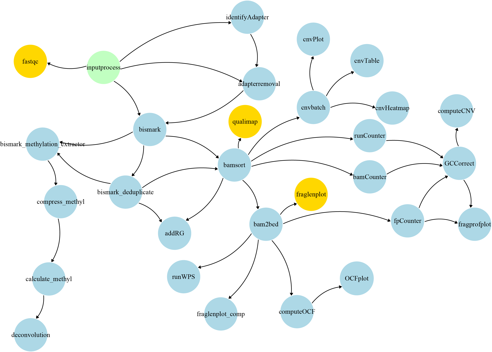

.. cfDNApipe documentation master file, created by
   sphinx-quickstart on Tue Jan  5 09:27:23 2021.
   You can adapt this file completely to your liking, but it should at least
   contain the root `toctree` directive.

Welcome to cfDNApipe's documentation!
=====================================

.. toctree::
   :maxdepth: 1
   :hidden:
   :caption: Contents:

   adapterremoval
   addRG
   bam2bed
   bamCounter
   bamsort
   BaseRecalibrator
   bcftoolsVCF
   bismark
   bismark_deduplicate
   bismark_methylation_extractor
   bowtie2
   BQSR
   calculate_methyl
   cnvbatch
   cnvHeatmap
   cnvPlot
   cnvTable
   compress_methyl
   computeCNV
   computeDMR
   computeOCF
   contamination
   createPON
   dbimport
   fastqc
   filterMutectCalls
   fpCounter
   fraglenplot
   fraglenplot_comp
   fragprofplot
   gatherVCF
   GCCorrect
   getPileup
   identifyAdapter
   inputprocess
   mutect2n
   mutect2t
   OCFplot
   qualimap
   rmduplicate
   runCounter
   runDeconCCN
   virusdetect
   Configure
   Configure2
   pipeConfigure
   pipeConfigure2
   switchConfigure
   cfDNAWGBS
   cfDNAWGBS2
   cfDNAWGS
   cfDNAWGS2

**cfDNApipe(cell free DNA Pipeline)** is an integrated pipeline for
analyzing `cell-free DNA`_ WGBS/WGS data. It contains many cfDNA quality
control and feature extration algorithms. Also we collected some useful
cell free DNA references and provide them `here`_.

The whole pipeline was established based on processing graph principle.
Users can use the inside integrated pipeline for WGBS/WGS data as well
as build their own analysis pipeline from any intermediate data like bam
files. The main functions are as the following picture.

.. figure:: ./pics/pipeline.png

   cfDNApipe Functions 

WGS Related functions 
~~~~~~~~~~~~~~~~~~~~~

.. figure:: ./pics/WGS_pipeline.png

   WGS Dataflow Overview

WGBS Related functions 
~~~~~~~~~~~~~~~~~~~~~

   WGBS Dataflow Overview

.. _cell-free DNA: https://en.wikipedia.org/wiki/Circulating_free_DNA
.. _here: https://honchkrow.github.io/cfDNAReferences/

Indices and tables
==================

* :ref:`search`
